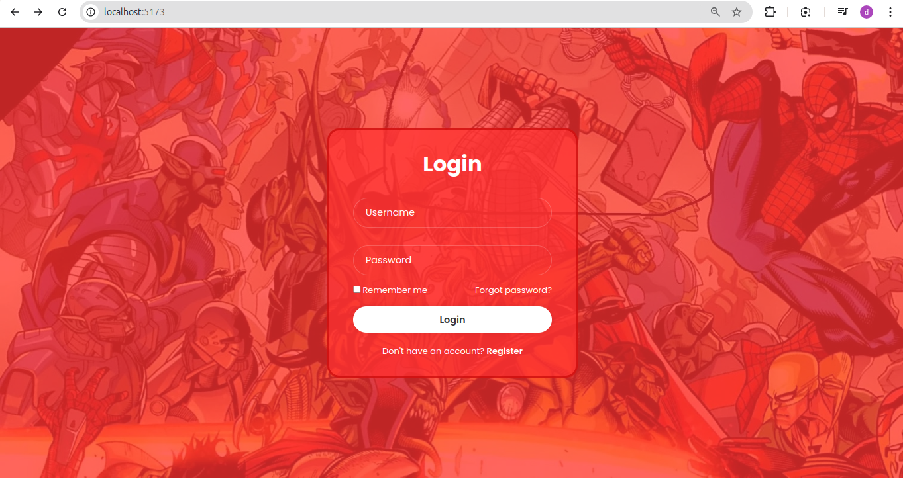
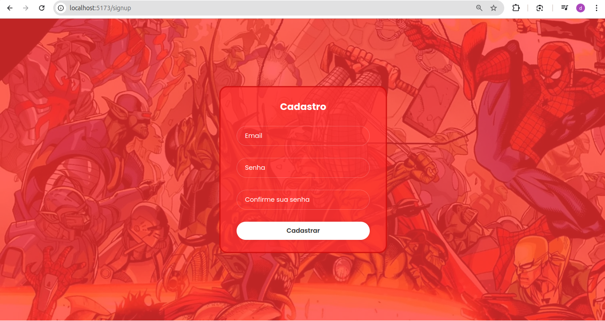
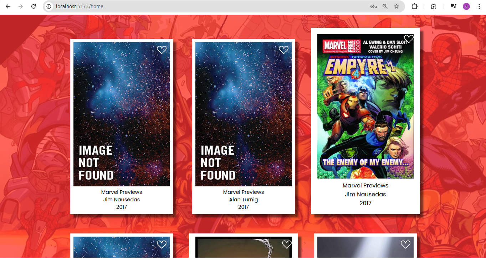
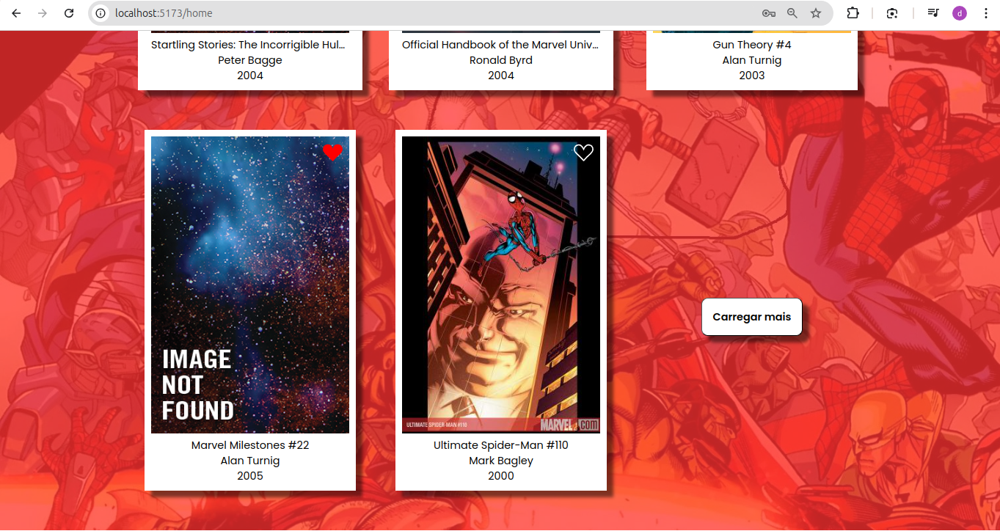

## Tecnologias Utilizadas

- **React** para construção de interfaces
- **Axios** para requisições HTTP
- **React Router DOM** para navegação
- **React Redux** para gerenciamento global de estados
- **TypesScript** para criação de tipagem
- **SASS** para estilização das páginas

## Instalação

**1.Clone o repositório: git clone https:** //github.com/Danilosrr/desafio-03-aws-react

**2.Navegue até o diretório do projeto:** cd hqmarvel-front

**3.Instale as dependências:** npm install

**4.Inicie o servidor de desenvolvimento:** npm run dev

## Telas

    
     
    
     

